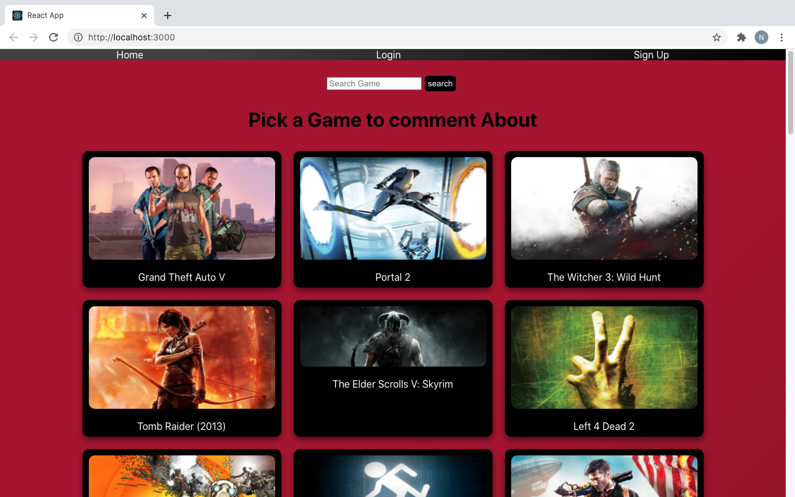
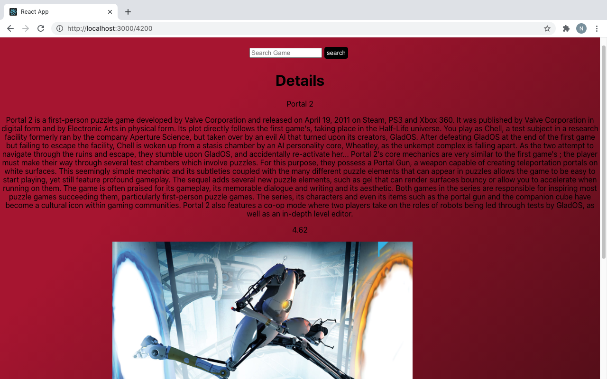

# Game_Status

### Date: 19 April 2021 

*** 
Owner
* Nick Williams:
[GitHub](https://github.com/NickWill24) | 
[LinkedIn](https://www.linkedin.com/in/nickwill24/)

***
#### ***Description***
Gamestatus is a flask, redux, and react full stack application. The purpose is to give user the ablity to post comment on 
their favortie game, or their worst game.  

***
#### ***Getting Started***
[Trello](https://trello.com/b/zpabiA2i/gamestatus) |
[Deployment](https://607dc196423841000752c9aa--laughing-borg-af67b1.netlify.app/)

***
#### ***Final Product*** 

***
### ***Technologies***
* Flask
* React 
* Redux

***
### ***Future Updates***
* [ ] Add a User Profile 
* [ ] Add a More game to the site
* [ ] Add a way to talk to other user 

*** 
### ***Credit***

* [Rawg Site API](https://rawg.io/apidocs)